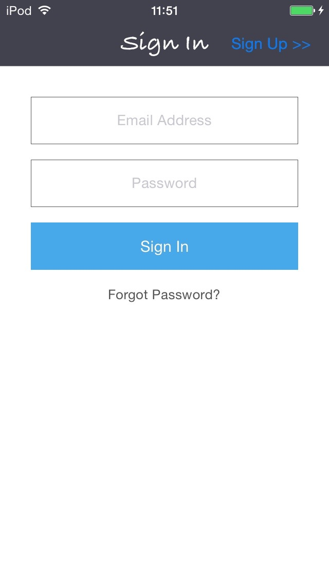
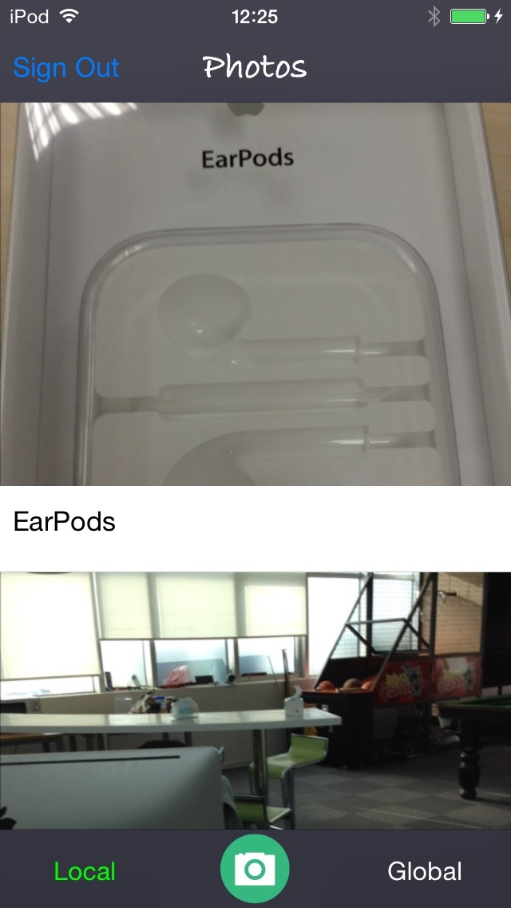

# Sample-PhotoWall-iOS

## 介绍

在 PhotoWall 上，你可以看到附近十公里内分享的图片和全部的图片。你也可以 PhotoWall 很方便的分享有趣的照片。

## 演示功能

- 用户注册
- 用户登陆
- 重设密码，给用户发送一封重设密码的电子邮件
- 上传照片，并保存照片标题和当前地理位置
- 浏览附近十公里内的照片
- 浏览全部照片

## 效果截图

## 如何运行

- 克隆这个仓库，然后打开项目
- 在 leap.as 控制台中创建一个应用，下面称他为 MaxLeap 应用。如果已经创建，跳过这个步骤。
- 导航到开发者中心页面，添加类： 
	
	类名：`Photos`  
	
	列名称|类型
	-----|----
	title|String
	location|GeoPoint
	image|File
	
- 在 `AppDelegate.` 中填写 MaxLeap 应用的 `applicationId` 和 `clientKey`.
- 按下 <kbd>Commond</kbd> + <kbd>R</kbd> 按钮运行

## 了解更多

详细信息请查看官方 [MaxLeap iOS 开发指南](https://maxleap.cn/zh_cn/guide/devguide/ios.html);
